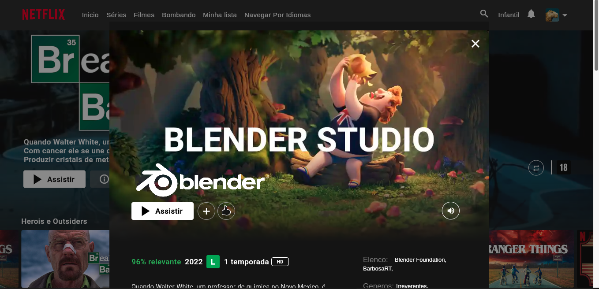

# Netflix Clone

A Clone of the Netflix UI (as the name implies), made for learning purposes. 
If you want to see my other "serious" project, check [bossa](https://github.com/BarbosaRT/Bossa)  

PS: Netflix pls don't sue me :)  
  
Data Source: TMDB, uNoGs

## Showcase

  
  
  
  
  

## Instructions 

Requirements: python >= 3.6, dart >= 2.17  

Python (Only needed to make it function offline):  
```
pip install pytube, requests, json, unidecode
```

You will need a TMDB api key, you can get one [here](https://developers.themoviedb.org/3/getting-started/introduction), after that replace the apiKey variable in the lib/core/api/content_controller.dart 

## Extras
original smooth_scroll by [dezso15](https://gitlab.com/dezso15/smoothscrollweb) 