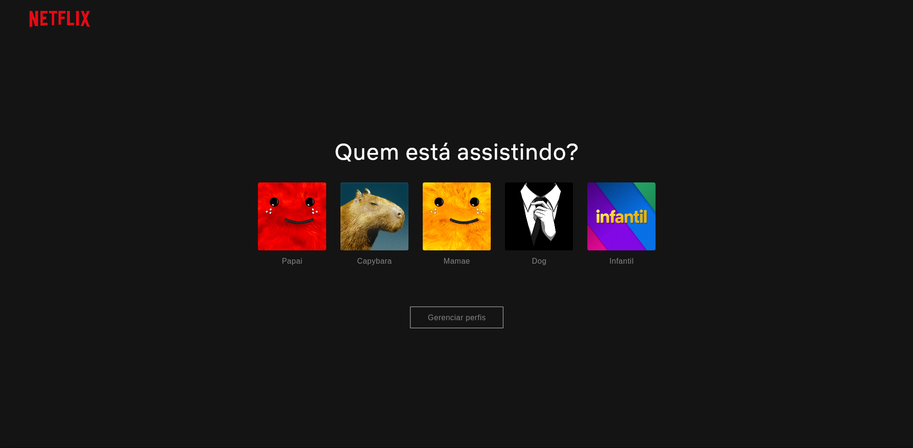
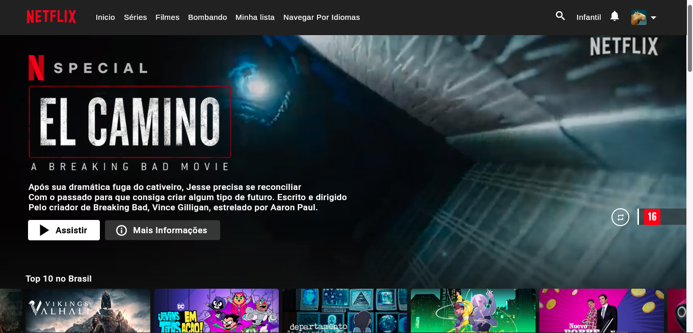

<h1 align="center">
  
</h1>
<p align="center">A Netflix Clone (as the name implies), made for learning purposes.</p>
<p align="center">If you want to see my other "serious" project, check <a href=https://github.com/BarbosaRT/Bossa>bossa</a></p>

# 

  
  
  
  
  

# Requirements: 
- python >= 3.6 
- dart >= 3.7 
- [git](https://git-scm.com)

## Python (Only needed to make it function offline):  
```
pip install pytube, requests, json, unidecode
```
# Clone and Execute
Clone this repository:
```
git clone https://github.com/BarbosaRT/NetflixClone.git
```
Access the directory:
```
cd NetflixClone
```
You will need a TMDB api key, you can get one [here](https://developers.themoviedb.org/3/getting-started/introduction), after that replace the apiKey variable in lib/core/api/content_controller.dart and in lib/scripts/api.py

Now install the dependencies:
```
flutter pub get
```
And run:
```
flutter run
```


# Extras
- Original smooth_scroll by [dezso15](https://gitlab.com/dezso15/smoothscrollweb)   
- Data Sources: TMDB, uNoGs      
